# MANUAL TECNICO

_El manual técnico hace referencia a la información necesaria con el fin de orientar al personal en la concepción, planteamiento análisis programación e instalación del sistema. Es de notar que la redacción propia del manual técnico está orientada a personal con conocimientos en sistemas y tecnologías de información, conocimientos de programación avanzada sobre JavaScript, responsables del mantenimiento e instalación del programa computacional en el computador._

## Introduccion 📄
El presente documento describe la seria de pasos que realizan algunos de los métodos o funciones que conforman el programa computacional (EDD GoDrive) por medio de fragmentos de código, como también se detalla los conocimientos previos que debe tener el lector de este manual para comprender de una mejor manera el funcionamiento de cada una de las partes del código que conforman el programa.

## Objetivos ✔️
* Instruir el uso adecuado del programa computacional, describiendo el diseño y la lógica del programa por medio de fragmentos de códigos.
* Describir al usuario el funcionamiento del programa para el mejor uso de él y demostrar el proceso necesario para su ejecución.
* Orientar al usuario a entender la estructura del programa, como lo son sus clases y cada uno de los métodos que componen dicha clase.

## Conocimientos Previos 💡
Los conocimientos mínimos que deben tener las personas que operarán las páginas y deberán utilizar este manual son:

* Conocimientos en lenguaje de programacion JavaScript.
* Cocimientos y entendimientos en logaritmos
* Conocimientos en Tipos de Datos Abstractos (TDA)
* Conocimiento básico de Windows 

## Requerimientos 📋
El sistema puede ser instalado en cualquier sistema operativo que cumpla con los siguientes requerimientos:

* Sistema Operativo: Windows 7 o superior
* Procesador mínimo Intel Pentium (800MHz Intel Pentium)
* Mínimo 1GB en RAM
* IDE Visual Studio Code, o compatible con Python
* Exploradores: Internet Explorer 9 y superior

## Instalación y Configuración 🔧
Para el proceso de instalación de esta aplicación únicamente es necesario tener instalado un IDE que sea compatible con el lenguaje de programacion JavaScript para ejecutar la aplicación desde la terminal de este.

No es necesario tener alguna configuración ya que la configuración que trae por determinado el IDE es la necesaria para que el funcionamiento del programa sea posible.

## Despliegue 🚀
Para ejecutar el proyecto es necesario abrir el archivo login.html ya que este es el principal.

## Estructura del Proyecto 🔩
En este apartado se muestran las carpetas implementadas para el optimo funcionamiento y ordenamiento del programa.

<div>
<p style = 'text-align:center;'>
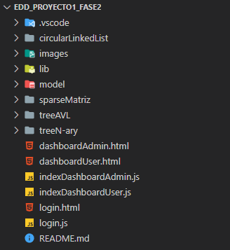
</p>
</div>

## Fragmentos de Código 💻
En este apartado se explican detalladamente los método y funciones más importantes que conforman el código del programa. Esto con el objetivo de que la persona a usar el programa necesite dar soporte a la aplicación se le realice una manera más sencilla comprender la lógica del programa.

### Codigo de la Clase **Student**
```
class Student {
    constructor(nombre, carnet, password, carpeta_raiz, carpetas, acciones) {
        this.nombre = nombre;
        this.carnet = carnet;
        this.password = password;
        this.carpeta_raiz = carpeta_raiz;
        this.carpetas = carpetas;
        this.acciones = acciones;
    }

    //GETTERS
    get name() {
        return this.nombre;
    }
	...
	
	//SETTERS
    set name(new_name) {
        this.nombre = new_name;
    }
	....
	
}
```
Esta clase hace referencia a un usuario el cual es de tipo estudiante como se puede observar el estudiante posee atributos, como lo son "carpetas" y "acciones" en donde el atributo "carpetas" es una instancia de la clase "Tree" que representa un arbol n-ario y el atributo es una instancia de la clase "CircularLinkedList" que representa una lista enlazada circular.

### Codigo de la Clase **SparseMatrix**
```
class Mnode {
    constructor(x = "", y = "", value, content, type) {
        this.x = x.toString();
        this.y = y.toString();
        this.value = value;
        this.content = content;
        this.type = type;
        this.up = null;
        this.down = null;
        this.right = null;
        this.left = null;
    }
}

class SparseMatrix {
    constructor(folderName) {
        this.folderName = folderName;
        this.head = new Mnode(-1, -1, folderName);
    }

    insert(x, y, value) {
        this.#xHeaders(x);
        this.#yHeaders(y);
        const node = new Mnode(x, y, value);
        this.#addX(node, x);
        this.#addY(node, y);
    }
  }
```
La clase "SparseMatrix" hace referencia a una matriz dispersa. Para la creacion de esta clase fue necesario implementar un nodo ya que el nodo permite enlazar un dato con otro y este a su vez contiente atributos. Esta clase posee metodos y funciones las cuales sirven para el funcionamiento correcto de esta en el codigo anterior se puede oberservar la funcion "insertar" la cual solo es una parte de la verdadera funcion.

### Codigo de la Clase **CircularLinkedList**
```
class CllNode {
    constructor(value) {
        this.value = value;
        this.next = null;
    }
}

class CircularLinkedList {
    constructor() {
        this.head = null;
        this.tail = null;
    }

	//Metodos y Funciones
}
```
La clase "CircularLinkedList" hace referencia a una lista circular enlazada. Para la creacion de esta clase fue necesario implementar un nodo ya que el nodo permite enlazar un dato con otro. Esta clase posee metodos y funciones las cuales sirven para el funcionamiento correcto de esta.

### Codigo de la funcion **login()**
```
function login() {
  const username = forms[0][0].value;
  const password = forms[0][1].value;
  if (username != "" && password != "") {
    if (username == "Admin") {
      if (password == "Admin") {
        location.href = "dashboardAdmin.html"
      } else {
        incorrectPassword();
      }
    } else {
      exist = avlTree.searchNode(parseInt(username));
      if (exist) {
        if (password == exist.value.password) {
          circular_list = exist.value.acciones;
          localStorage.setItem("circularLinkedList", JSON.stringify(JSON.decycle(circular_list)));
          localStorage.setItem('currentUser', username);
          location.href = "dashboardUser.html";
        } else {
          incorrectPassword();
        }
      } else {
        Swal.fire({
          position: 'center',
          icon: 'warning',
          title: 'Usuario no existe',
          showConfirmButton: false,
          timer: 1000
        })
      }
    }
  }
}
```
Esta funcion es la encargada de verificar que al momento en el que el usuario ingrese sus datos en el formulario, el usuario sea de tipo administrador o estudiante, de no ser asi se lanzara un mensaje en el cual se indica que el usuario no existe.

### Codigo de la funcion **loadStudentsForm()**
```
function loadStudentsForm(e) {
    e.preventDefault();
    const formData = new FormData(e.target);
    const form = Object.fromEntries(formData);
    let studentsArray = [];
    try {
        let fr = new FileReader();
        fr.readAsText(form.inputFile);
        fr.onload = () => {
            studentsArray = JSON.parse(fr.result).alumnos;
            for (let i = 0; i < studentsArray.length; i++) {
                let actions = new CircularLinkedList();
                let folders = new Tree();
                let student = new Student(studentsArray[i].nombre, studentsArray[i].carnet, studentsArray[i].password, "/", folders, actions);
                avlTree.insert(student);
            }
            $('#studentsTable tbody').html(
                avlTree.inOrder()
            )
            localStorage.setItem("avlTree", JSON.stringify(JSON.decycle(avlTree)));
            Swal.fire({
                position: 'bottom-end',
                icon: 'success',
                title: '¡Estudiantes Agregados Exitosamente!',
                showConfirmButton: false,
                timer: 1000
            })
            document.getElementById('inputFile').value = '';
        }
    } catch (error) {
        console.log(error);
        Swal.fire({
            position: 'bottom-end',
            icon: 'error',
            title: '¡Estudiantes No Agregados!',
            showConfirmButton: false,
            timer: 1000
        })
    }
}
```
Esta funcion se encarga de obtener los datos que se encuentran almacenados en el archivo a leer.
El comportamiento de esta funcion es el siguiente: lee linea por linea del archivo e inserta el valor obtenido a un ojeto de tipo "AVLTree" el cual hace referencia a un arbol AVL, luego de leer linea por linea los datos obtenidos son cargados a una tabla, los cuales son mostrados ordenadamente y por ultimo lanza un mensaje de realizado.

### Codigo de la funcion **createFolder()**
```
function createFolder(e) {
    e.preventDefault();
    let folderName = $('#folderName').val();
    let path = $('#path').val();
    folderName = tree.verifyFolder(folderName, path);
    console.log(folderName);
    tree.insert(folderName, path);
    newCircularList.insert(messageCreateFolder(folderName));
    Swal.fire({
        position: 'bottom-end',
        icon: 'success',
        title: '¡Carpeta creada exitosamente!',
        showConfirmButton: false,
        timer: 1000
    })
    $('#folders').html(tree.getHTML(path));
    loadFolderInList();
    document.getElementById('folderName').value = '';
    saveData();
}
```
La funcion "createFolder" es la encarga de que al momento en el que el usuario cree una carpeta esta sea almacenada en su respectivo lugar. La funcion primero verifica si el nombre de la carpeta ya existe y de ser asi se creara la carpeta pero se le agregara un numero, esto para tener una mejor referencia de la carpeta y evitar confusiones.

## Construido con 🛠️
_Para la creacion del proyecto se utilizaron los siguientes lenguajes y librerias:_

* [HTML](https://developer.mozilla.org/es/docs/Web/HTML) - Usado para la estructura del proyecto.

* [CSS](https://developer.mozilla.org/es/docs/Web/CSS) - Usado para el estilo del proyecto.

* [Bootstrap](https://getbootstrap.com/) - Usado para el estilo del proyecto.

* [JavaScript](https://developer.mozilla.org/es/docs/Web/JavaScript) - Usado para la funcionalidad dinamica del proyecto.

## Autor ✒️
* [Pedro Luis Tavico](https://github.com/luis-tavico)

<br>

***

<br>

# MANUAL DE USUARIO

_El manual de usuario hace referencia a la información necesaria con el fin de orientar al usuario para que obtenga el maximo beneficio de la aplicacion web y pueda hacer un buen uso de esta. Es de notar que la redacción propia del manual de usuario está orientada a personal con poco conocimiento en sistemas y tecnologías de información._

## Introduccion 📄
El presente documento detalla de la mejor manera posible el funcionamiento de cada una de las partes que integra la aplicacion web, mostrando con imagenes y explicando cada uno de sus componentes que se muestra en la pantalla actual en la que se encuentre el usuario.

## Objetivo ✔️
Brindar asistencia al usuario de este programa informático (EDD GoDrive), describiendo las opciones o el funcionamiento del proceso que se muestra en cada una de las pantallas conforme al usuario vaya avanzando en dicho programa.

## Requerimientos 📋
El sistema puede ser instalado en cualquier sistema operativo que cumpla con los siguientes requerimientos: 
* Sistema Operativo: Windows 7 o superior
* Procesador mínimo: Intel Pentium (800MHz Intel Pentium)
* Mínimo 1GB en RAM
* IDE Visual Studio Code o compatible con JavaScript
* Exploradores: Internet Explorer 9 o superior

## Inicio de Sesion
Al iniciar con la aplicacion se muestra esta pantalla en la cual el usario debe ingresar su nombre de usuario y contraseña para acceder a su panel correspondiente.

<div>
<p style = 'text-align:center;'>
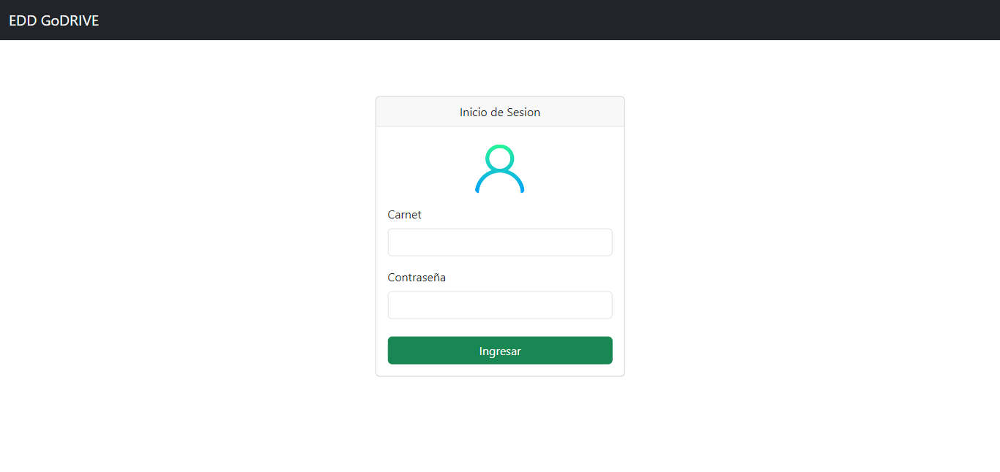
</p>
</div>

## Administrador
Si el usuario es de tipo "Administrador" se monstrara esta pantalla en la cual se encuetran las acciones que el usario puede realizar.

<div>
<p style = 'text-align:center;'>
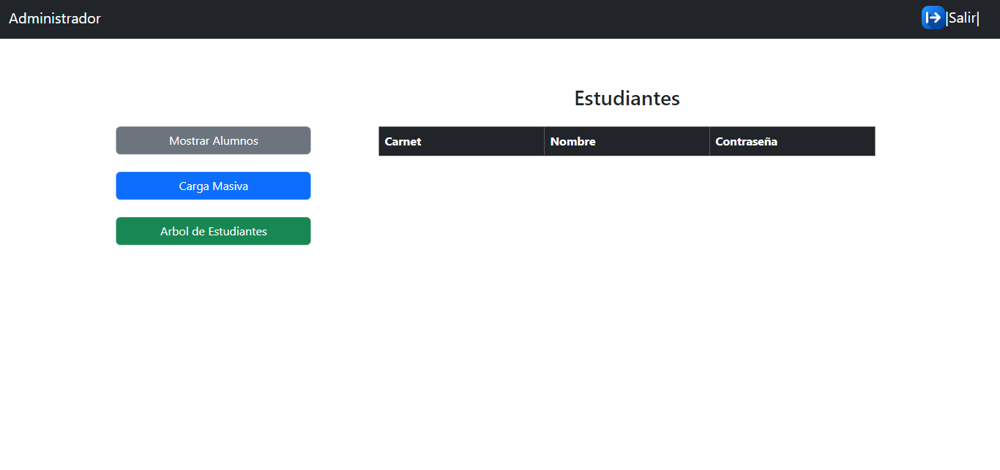
</p>
</div>

## Cargar Archivo
Al presionar el boton "Carga Masiva" se muestra un ventana emergente en la cual el usuario puede seleccionar el archivo que desea mostrar en la tabla estudiantes.

<div>
<p style = 'text-align:center;'>
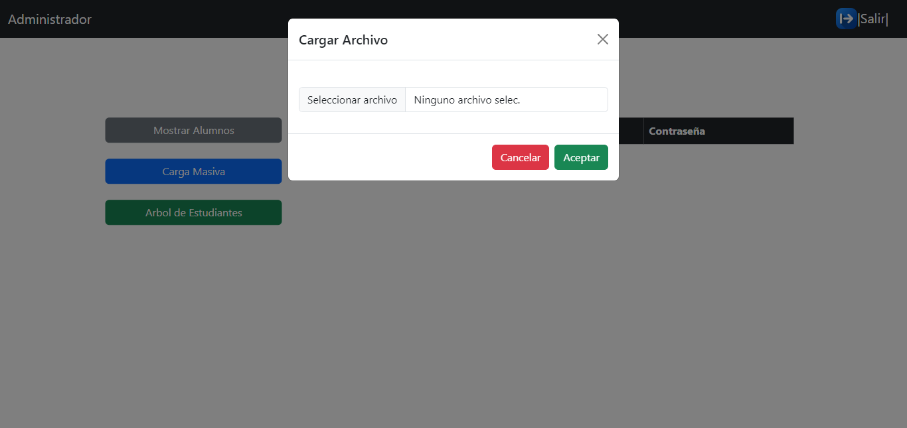
</p>
</div>

## Seleccionar Orden
Al presionar el boton "Mostrar Alumnos" se muestra un ventana emergente en la cual el usuario puede elegir el orden en que desea que se muestren los estudiantes en la tabla.

<div>
<p style = 'text-align:center;'>
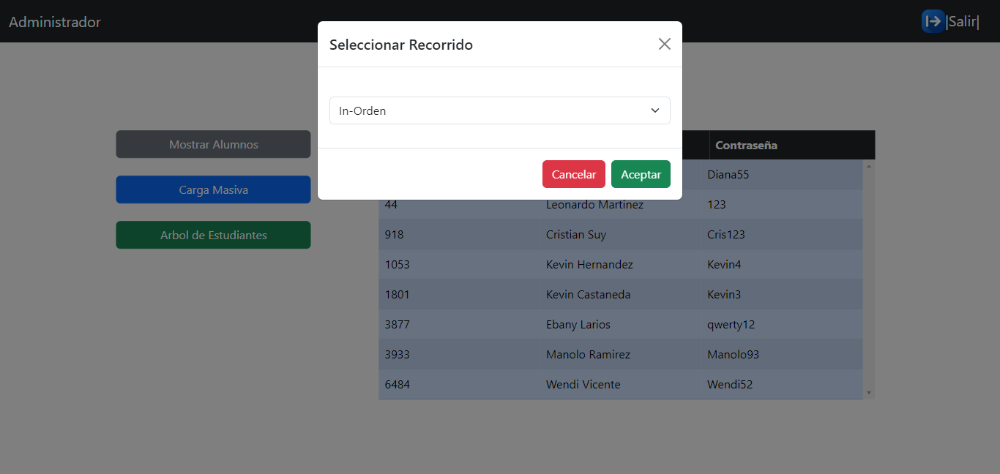
</p>
</div>

## Mostar Grafico de Arbol AVL
Al presionar el boton "Arbol de Estudiantes" se desplegara una ventana emergente en la que se muestran todos los estudiantes existentes ordenados.

<div>
<p style = 'text-align:center;'>
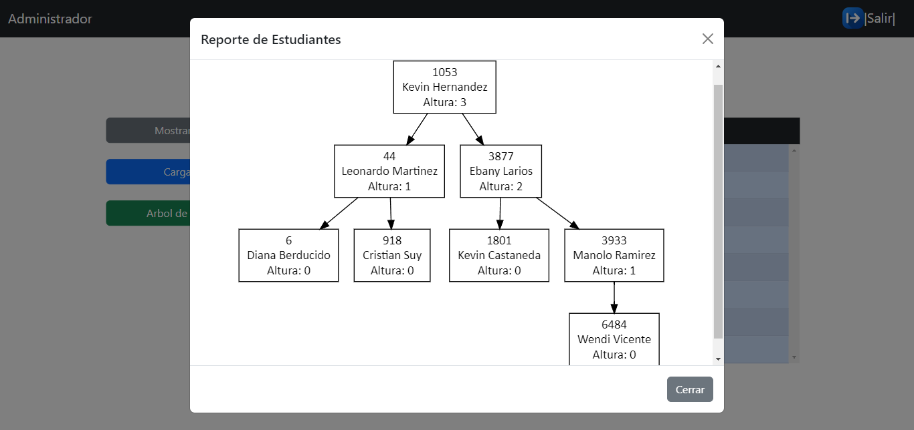
</p>
</div>

## Usuario
Si el usuario es de tipo "Estudiante" se mostrara esta pantalla en la cual se encuetran las acciones que el usario puede realizar.

<div>
<p style = 'text-align:center;'>
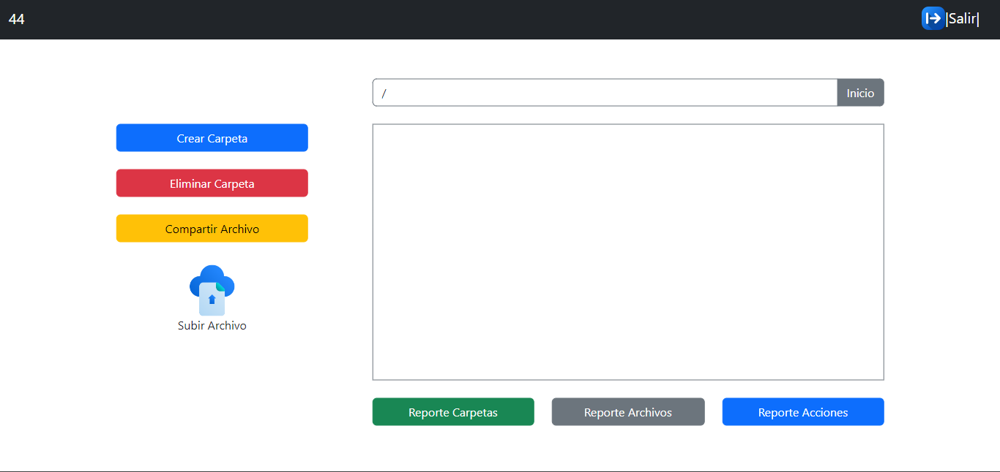
</p>
</div>

## Crear Carpeta
El usuario puede crear carpetas al momento de presionar el boton "Crear Carpeta" las cuales son mostradas en un contenedor visible para el usuario.

<div>
<p style = 'text-align:center;'>
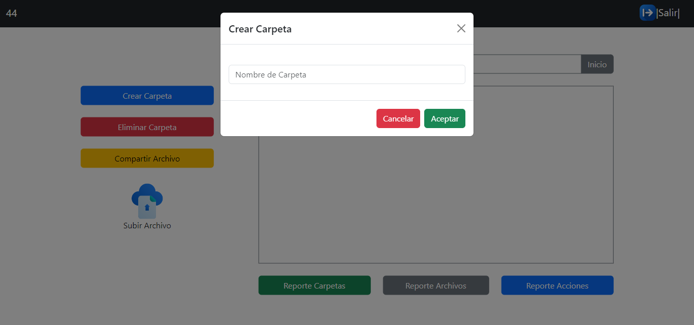
</p>
</div>

## Eliminar Carpeta
El usuario puede eliminar carpetas al momento de presionar el boton "Eliminar Carpeta" donde se mostrara una ventana emergente y podra elegir la carpeta que desea eliminar.

<div>
<p style = 'text-align:center;'>
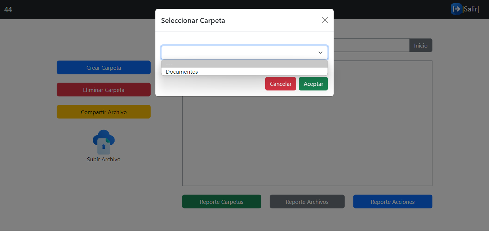
</p>
</div>

## Permisos de Archivo
El usuario puede otorgar permisos de sus archivos a otros usuarios. Para ello es necesario presionar el boton "Compartir Archivo" donde se mostrar una ventana emergen en la cual el usario podra elegir el usuario, el archivo y el tipo de permiso a conceder.

<div>
<p style = 'text-align:center;'>
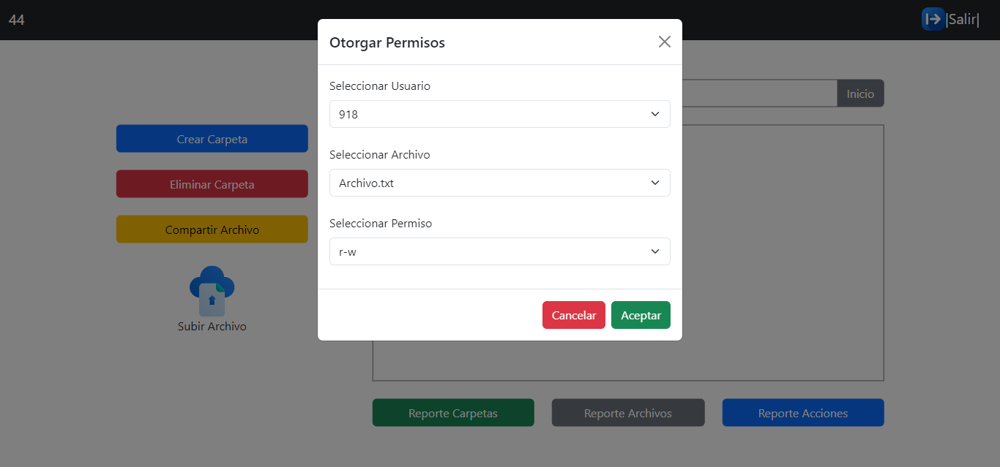
</p>
</div>

## Subir Archivo
El usuario puede subir archivos al momento de presionar el boton "Subir archivo" donde se mostrara una ventana emergente en la cual el usuario podra seleccionar el archivo que desea subir. Es importante tener en cuenta que solo se permiten subir archivos de tipo pdf, txt e imagenes de cualquier tipo.

<div>
<p style = 'text-align:center;'>
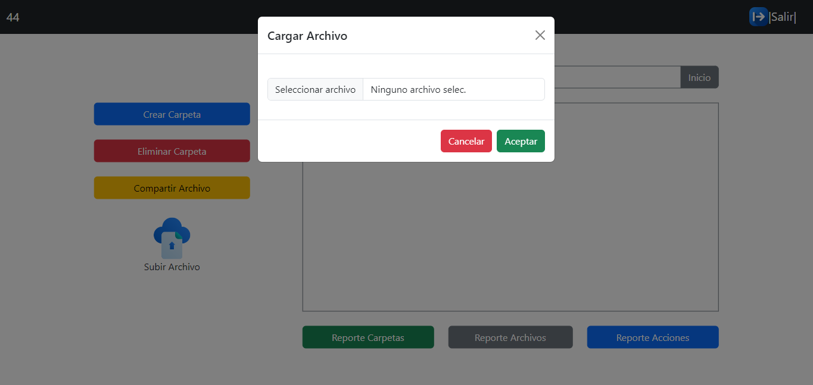
</p>
</div>

## Mostrar Grafico de Carpetas
Al presionar el boton "Reporte Archivos" se despleguera una ventana emergente donde el usario puedra observar en un grafico todos los permisos otorgados de sus archivos a otros usuarios.

<div>
<p style = 'text-align:center;'>
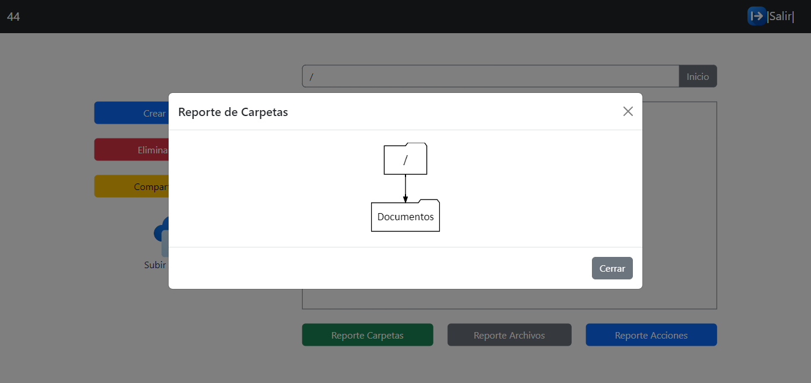
</p>
</div>

## Mostrar Grafico de Permisos 
Al presionar el boton "Reporte Carpetas" se despleguera una ventana emergente donde el usario puedra observar en un grafico todas las carpetas existentes.

<div>
<p style = 'text-align:center;'>
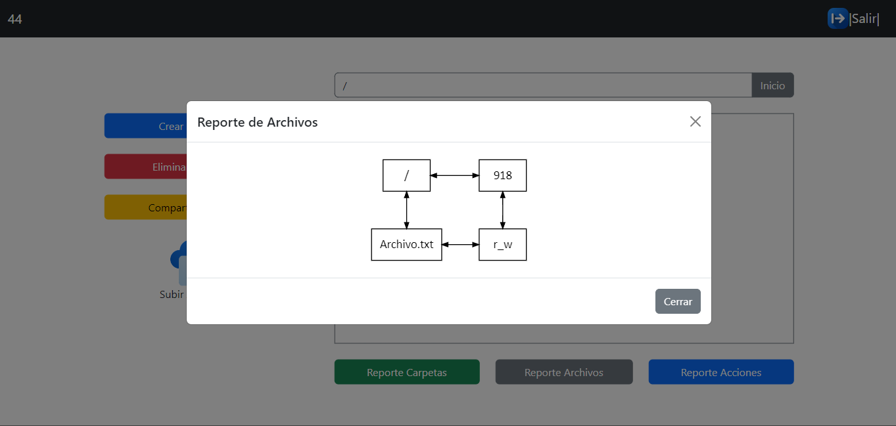
</p>
</div>

## Mostrar Grafico de Bitacora
Al presionar el boton "Reporte Acciones" se despleguera una ventana emergente donde el usario puedra observar en un grafico todas las aciones que ha realizado como crear o eliminar una carpeta.

<div>
<p style = 'text-align:center;'>
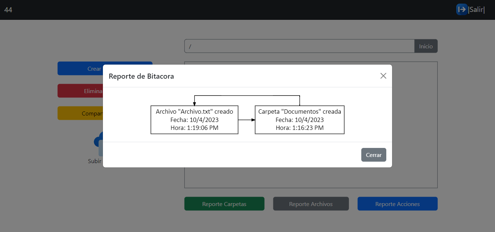
</p>
</div>

## Autor ✒️
* [Pedro Luis Tavico](https://github.com/luis-tavico)