# MANUAL TECNICO

_El manual técnico hace referencia a la información necesaria con el fin de orientar al personal en la concepción, planteamiento análisis programación e instalación del sistema. Es de notar que la redacción propia del manual técnico está orientada a personal con conocimientos en sistemas y tecnologías de información, conocimientos de programación avanzada sobre JavaScript, responsables del mantenimiento e instalación del programa computacional en el computador._

## Introduccion 📄
El presente documento describe la seria de pasos que realizan algunos de los métodos o funciones que conforman el programa computacional (EDD GoDrive) por medio de fragmentos de código, como también se detalla los conocimientos previos que debe tener el lector de este manual para comprender de una mejor manera el funcionamiento de cada una de las partes del código que conforman el programa.

## Objetivos ✔️
* Instruir el uso adecuado del programa computacional, describiendo el diseño y la lógica del programa por medio de fragmentos de códigos.
* Describir al usuario el funcionamiento del programa para el mejor uso de él y demostrar el proceso necesario para su ejecución.
* Orientar al usuario a entender la estructura del programa, como lo son sus clases y cada uno de los métodos que componen dicha clase.

## Conocimientos Previos 💡
Los conocimientos mínimos que deben tener las personas que operarán las páginas y deberán utilizar este manual son:

* Conocimientos en lenguaje de programacion JavaScript.
* Cocimientos y entendimientos en logaritmos
* Conocimientos en Tipos de Datos Abstractos (TDA)
* Conocimiento básico de Windows 

## Requerimientos 📋
El sistema puede ser instalado en cualquier sistema operativo que cumpla con los siguientes requerimientos:

* Sistema Operativo: Windows 7 o superior
* Procesador mínimo Intel Pentium (800MHz Intel Pentium)
* Mínimo 1GB en RAM
* IDE Visual Studio Code, o compatible con Python
* Exploradores: Internet Explorer 9 y superior

## Instalación y Configuración 🔧
Para el proceso de instalación de esta aplicación únicamente es necesario tener instalado un IDE que sea compatible con el lenguaje de programacion JavaScript para ejecutar la aplicación desde la terminal de este.

No es necesario tener alguna configuración ya que la configuración que trae por determinado el IDE es la necesaria para que el funcionamiento del programa sea posible.

## Despliegue 🚀
Para ejecutar el proyecto es necesario abrir el archivo login.html ya que este es el principal.

## Estructura del Proyecto 🔩
En este apartado se muestran las carpetas implementadas para el optimo funcionamiento y ordenamiento del programa.

<div>
<p style = 'text-align:center;'>
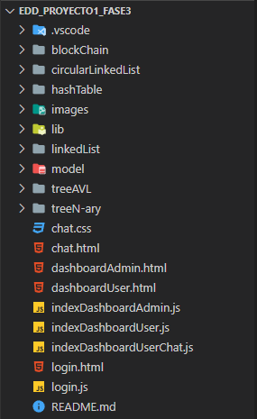
</p>
</div>

## Fragmentos de Código 💻
En este apartado se explican detalladamente los método y funciones más importantes que conforman el código del programa. Esto con el objetivo de que la persona a usar el programa necesite dar soporte a la aplicación se le realice una manera más sencilla comprender la lógica del programa.

### Codigo de la Clase **Student**
```
class Student {
    constructor(nombre, carnet, password, carpeta_raiz, carpetas, acciones) {
        this.nombre = nombre;
        this.carnet = carnet;
        this.password = password;
        this.carpeta_raiz = carpeta_raiz;
        this.carpetas = carpetas;
        this.compartidoConmigo = [];
        this.acciones = acciones;
    }

    //GETTERS
    get name() {
        return this.nombre;
    }
	...
	
	//SETTERS
    set name(new_name) {
        this.nombre = new_name;
    }
	....
	
}
```
Esta clase hace referencia a un usuario el cual es de tipo estudiante como se puede observar el estudiante posee atributos, como lo son "carpetas" y "acciones" en donde el atributo "carpetas" es una instancia de la clase "Tree" que representa un arbol n-ario y el atributo es una instancia de la clase "CircularLinkedList" que representa una lista enlazada circular.

### Codigo de la funcion **login()**
```
function login() {
  const username = forms[0][0].value;
  const password = forms[0][1].value;
  if (username != "" && password != "") {
    if (username == "Admin") {
      if (password == "Admin") {
        location.href = "dashboardAdmin.html"
      } else {
        incorrectPassword();
      }
    } else {
      exist = avlTree.searchNode(parseInt(username));
      if (exist) {
        if (password == exist.value.password) {
          circular_list = exist.value.acciones;
          localStorage.setItem("circularLinkedList", JSON.stringify(JSON.decycle(circular_list)));
          localStorage.setItem('currentUser', username);
          location.href = "dashboardUser.html";
        } else {
          incorrectPassword();
        }
      } else {
        Swal.fire({
          position: 'center',
          icon: 'warning',
          title: 'Usuario no existe',
          showConfirmButton: false,
          timer: 1000
        })
      }
    }
  }
}
```
Esta funcion es la encargada de verificar que al momento en el que el usuario ingrese sus datos en el formulario, el usuario sea de tipo administrador o estudiante, de no ser asi se lanzara un mensaje en el cual se indica que el usuario no existe.

### Codigo de la Clase **Tree**
```
class Tnode {
    constructor(folderName, weight) {
        this.folderName = folderName;
        this.files = [];
        this.children = [];
        this.id = null;
        this.weight = weight;
    }
}

class Tree {
    constructor() {
        this.root = new Tnode('/', 1);
        this.root.id = 0;
        this.size = 1;
    }

    insert(folderName, fatherPath) {
        let { node: fatherNode, weight } = this.getFolder(fatherPath);
        let newNode = new Tnode(folderName, weight);
        if (fatherNode) {
            this.size += 1;
            newNode.id = this.size;
            fatherNode.children.push(newNode);
        } else {
            console.log("Ruta no existe");
        }
    }
}
```
La clase "Tree" hace referencia a un arbol n-ario, en el codigo anterior se puede observar la clase con su respectivo nodo y el metodo "insert" el cual se encarga de agregar los nuevos valores al arbol y medida que los agrega calcula el peso de cada una de sus hojas. Esta clase es la encargada de almacenar las carpetas correspondientes de cada usuario creados por el mismo.

### Codigo de la Clase **BlockChain**
```
class Block {
    constructor(index, transmitter, receiver, message, previusHash, hash) {
        this.index = index;
        this.timestamp = this.getFormatDate();
        this.transmitter = transmitter;
        this.receiver = receiver;
        this.message = message;
        this.hour = new Date().toLocaleTimeString('en-US');
        this.previusHash = previusHash;
        this.hash = hash;
        this.next = null;
        this.prev = null;
  }
}

class BlockChain {
    constructor() {
        this.head = null;
        this.end = null;
        this.size = 0;
    }

    async insert(transmitter, receiver, message) {
        let newNode = new Block(this.size, transmitter, receiver, message, "", "");
        if (this.head == null) {
            newNode.previusHash = "00000";
            newNode.hash = await this.getSha256(newNode);
            this.head = newNode;
            this.end = newNode;
            this.size++;
        } else {
            newNode.previusHash = this.end.hash;
            newNode.hash = await this.getSha256(newNode);
            this.end.next = newNode;
            newNode.prev = this.end;
            this.end = newNode;
            this.size++;
        }
    }
}
```
La clase "BlockChain" hace referencia al sistema de seguridad e integridad con dicho nombre, el cual es utilizado para el envio de mensajes entre estudiantes. En el codigo de arriba podemos observar la clase con su respectivo nodo y el metodo "insert" que se encargar de ingresar los nuevos mensajes al sistema de seguridad.

### Codigo de la Clase **HashTable**
```
class HashNode {
    constructor(value) {
        this.value = value;
    }
}

class HashTable {
    constructor() {
        this.table = new Array(7);
        this.capacidad = 7;
        this.espaciosUsados = 0;
    }

    insert(value) {
        let indice = this.calcularIndice(value.carnet);
        let nodoNuevo = new HashNode(value);
        if (indice < this.capacidad) {
            if (this.table[indice] == null) {
                this.table[indice] = nodoNuevo;
                this.espaciosUsados++;
            } else {
                let contador = 1;
                indice = this.recalcularIndice(value.carnet, contador);
                while (this.table[indice] != null) {
                    contador++;
                    indice = this.recalcularIndice(value.carnet, contador);
                }
                this.table[indice] = nodoNuevo;
                this.espaciosUsados++;
            }
            this.checkCapacidad();
        }
    }
}
```
La clase "HashTable" es una estructura de datos que implementa el tipo de dato abstracto llamado Diccionario. Esta asocia llaves o claves con valores. En el codigo anterior se puede observar la clase con su nodo y el metodo "insert" el cual se encarga de ingresar los nuevos valores a la tabla.

### Codigo de la funcion **encrypt_data()**
```
function encrypt_data(string) {
    string = unescape(encodeURIComponent(string));
    var newString = '',
        char, nextChar, combinedCharCode;
    for (var i = 0; i < string.length; i += 2) {
        char = string.charCodeAt(i);
        if ((i + 1) < string.length) {
            nextChar = string.charCodeAt(i + 1) - 31;
            combinedCharCode = char + "" + nextChar.toLocaleString('en', {
                minimumIntegerDigits: 2
            });
            newString += String.fromCharCode(parseInt(combinedCharCode, 10));
        } else {
            newString += string.charAt(i);
        }
    }
    return newString.split("").reduce((hex, c) => hex += c.charCodeAt(0).toString(16).padStart(4, "0"), "");
}
```
La funcion "encrypt_data(string)" pide como parametro una cadena de caracteres y los devuelve encriptados, esta funcion es utilizada en el programa para encriptar la contraseña correspondiente de cada usuario.

### Codigo de la funcion **createFolder()**
```
function createFolder(e) {
    e.preventDefault();
    let folderName = $('#folderName').val();
    let path = $('#path').val();
    folderName = tree.verifyFolder(folderName, path);
    console.log(folderName);
    tree.insert(folderName, path);
    newCircularList.insert(messageCreateFolder(folderName));
    Swal.fire({
        position: 'bottom-end',
        icon: 'success',
        title: '¡Carpeta creada exitosamente!',
        showConfirmButton: false,
        timer: 1000
    })
    $('#folders').html(tree.getHTML(path));
    loadFolderInList();
    document.getElementById('folderName').value = '';
    saveData();
}
```
La funcion "createFolder" es la encarga de que al momento en el que el usuario cree una carpeta esta sea almacenada en su respectivo lugar. La funcion primero verifica si el nombre de la carpeta ya existe y de ser asi se creara la carpeta pero se le agregara un numero, esto para tener una mejor referencia de la carpeta y evitar confusiones.

## Construido con 🛠️
_Para la creacion del proyecto se utilizaron los siguientes lenguajes y librerias:_

* [HTML](https://developer.mozilla.org/es/docs/Web/HTML) - Usado para la estructura del proyecto.

* [CSS](https://developer.mozilla.org/es/docs/Web/CSS) - Usado para el estilo del proyecto.

* [Bootstrap](https://getbootstrap.com/) - Usado para el estilo del proyecto.

* [JavaScript](https://developer.mozilla.org/es/docs/Web/JavaScript) - Usado para la funcionalidad dinamica del proyecto.

## Autor ✒️
* [Pedro Luis Tavico](https://github.com/luis-tavico)

<br>

***

<br>

# MANUAL DE USUARIO

_El manual de usuario hace referencia a la información necesaria con el fin de orientar al usuario para que obtenga el maximo beneficio de la aplicacion web y pueda hacer un buen uso de esta. Es de notar que la redacción propia del manual de usuario está orientada a personal con poco conocimiento en sistemas y tecnologías de información._

## Introduccion 📄
El presente documento detalla de la mejor manera posible el funcionamiento de cada una de las partes que integra la aplicacion web, mostrando con imagenes y explicando cada uno de sus componentes que se muestra en la pantalla actual en la que se encuentre el usuario.

## Objetivo ✔️
Brindar asistencia al usuario de este programa informático (EDD GoDrive), describiendo las opciones o el funcionamiento del proceso que se muestra en cada una de las pantallas conforme al usuario vaya avanzando en dicho programa.

## Requerimientos 📋
El sistema puede ser instalado en cualquier sistema operativo que cumpla con los siguientes requerimientos: 
* Sistema Operativo: Windows 7 o superior
* Procesador mínimo: Intel Pentium (800MHz Intel Pentium)
* Mínimo 1GB en RAM
* IDE Visual Studio Code o compatible con JavaScript
* Exploradores: Internet Explorer 9 o superior

## Inicio de Sesion
Al iniciar con la aplicacion se muestra esta pantalla en la cual el usario debe ingresar su nombre de usuario y contraseña para acceder a su panel correspondiente.

<div>
<p style = 'text-align:center;'>
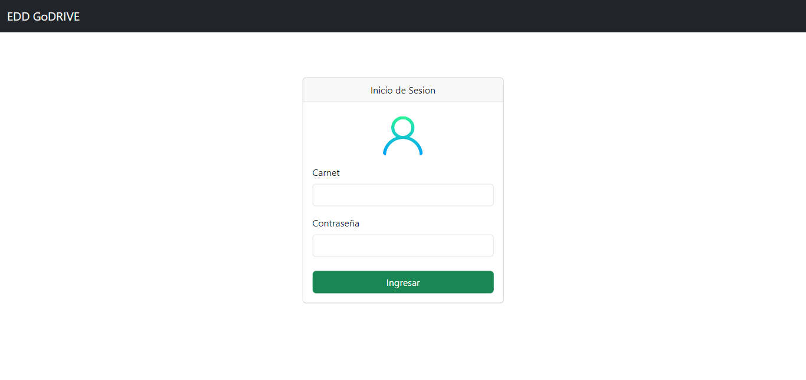
</p>
</div>

## Administrador
Si el usuario es de tipo "Administrador" se monstrara esta pantalla en la cual se encuetran las acciones que el usario puede realizar. Tambien se encuentran los alumnos ya cargados por el administrador mostrados en una tabla y los permisos que cada estudiante ha otorgado mostrados en la tabla de abajo.

<div>
<p style = 'text-align:center;'>
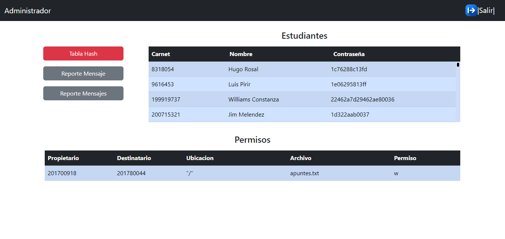
</p>
</div>

## Tabla Hash
Al presionar el boton "Tabla Hash" los alumnos cargados en el sistema se muestran en un orden distinto, ya que este es el perteneciente a la tabla hash.

<div>
<p style = 'text-align:center;'>
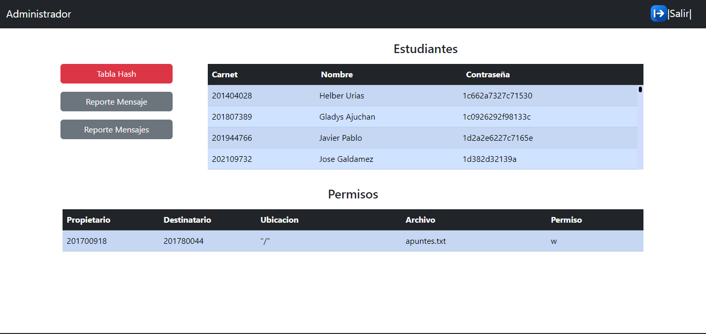
</p>
</div>

## Reporte Mensaje
Al presionar el boton "Reporte Mensaje" se muestra un ventana emergente en la cual el administrador puede observar todos los mensajes que se han enviado cada uno de los estudiantes desplegados en una tabla.

<div>
<p style = 'text-align:center;'>
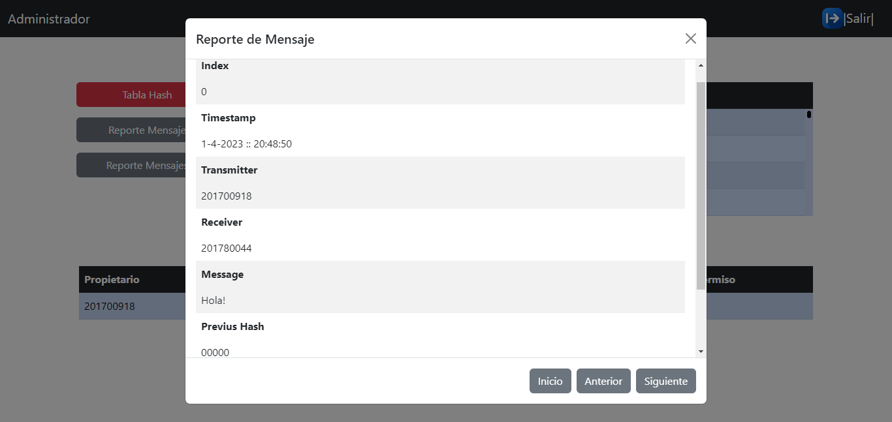
</p>
</div>

## Reporte Mensajes
Al presionar el boton "Reporte Mensajes" se muestra un ventana emergente en la cual el administrador puede observar todos los mensajes que se han enviado cada uno de los estudiantes desplegados en una imagen.

<div>
<p style = 'text-align:center;'>
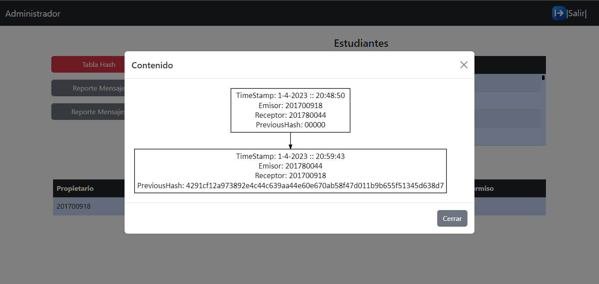
</p>
</div>

## Usuario
Si el usuario es de tipo "Estudiante" se mostrara esta pantalla en la cual se encuetran las acciones que el usario puede realizar.

<div>
<p style = 'text-align:center;'>
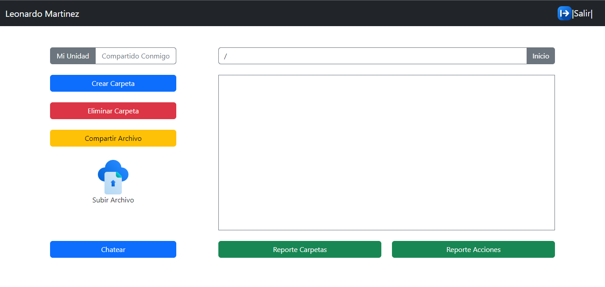
</p>
</div>

## Compartido Conmigo
Al hacer click sobre el boton "Compartido Conmigo" el usuario podra ver todos los archivo que han sido compartidos con el, como tambien tendra la opcion de poder visualizar su contenido en una vista emergente.

<div>
<p style = 'text-align:center;'>
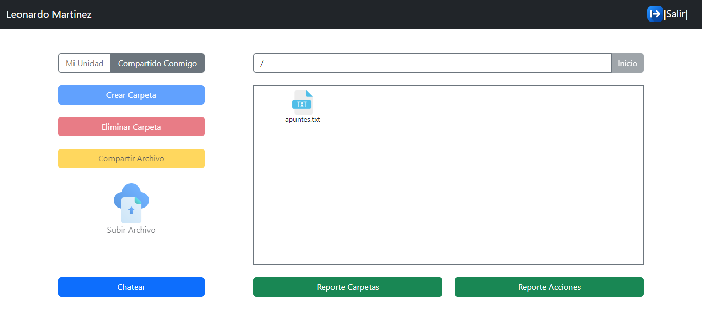
</p>
</div>

## Crear Carpeta
El usuario puede crear carpetas al momento de presionar el boton "Crear Carpeta" las cuales son mostradas en un contenedor visible para el usuario.

<div>
<p style = 'text-align:center;'>

</p>
</div>

## Eliminar Carpeta
El usuario puede eliminar carpetas al momento de presionar el boton "Eliminar Carpeta" donde se mostrara una ventana emergente y podra elegir la carpeta que desea eliminar.

<div>
<p style = 'text-align:center;'>
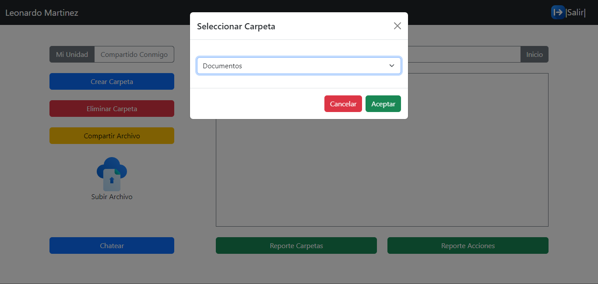
</p>
</div>

## Permisos de Archivo
El usuario puede otorgar permisos de sus archivos a otros usuarios. Para ello es necesario presionar el boton "Compartir Archivo" donde se mostrar una ventana emergen en la cual el usario podra elegir el usuario, el archivo y el tipo de permiso a conceder.

<div>
<p style = 'text-align:center;'>
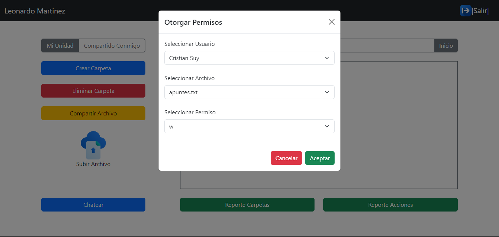
</p>
</div>

## Subir Archivo
El usuario puede subir archivos al momento de presionar el boton "Subir archivo" donde se mostrara una ventana emergente en la cual el usuario podra seleccionar el archivo que desea subir. Es importante tener en cuenta que solo se permiten subir archivos de tipo pdf, txt e imagenes de cualquier tipo.

<div>
<p style = 'text-align:center;'>
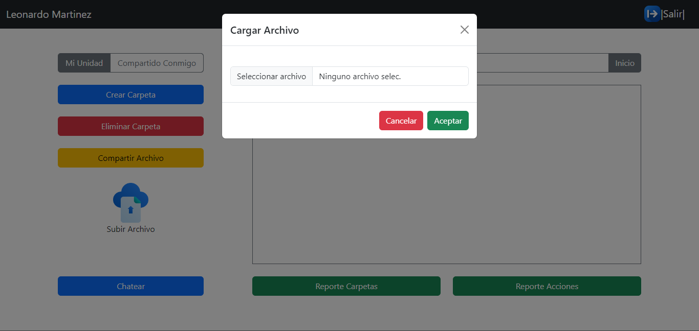
</p>
</div>

## Mostrar Grafico de Carpetas
Al presionar el boton "Reporte Archivos" se despleguera una ventana emergente donde el usario puedra observar en un grafico todos los permisos otorgados de sus archivos a otros usuarios.

<div>
<p style = 'text-align:center;'>
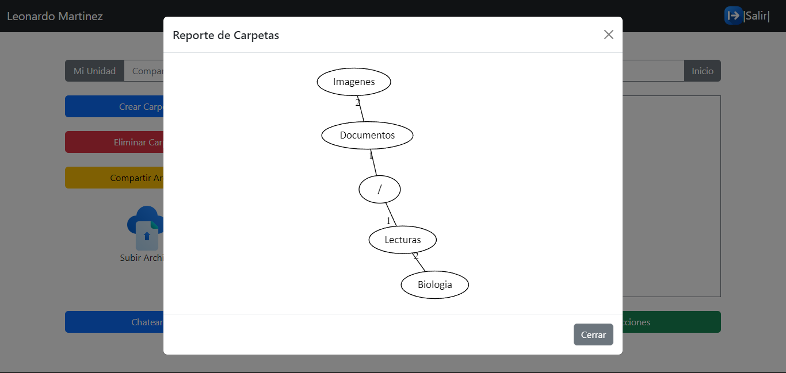
</p>
</div>

## Mostrar Grafico de Bitacora
Al presionar el boton "Reporte Acciones" se despleguera una ventana emergente donde el usario puedra observar en un grafico todas las aciones que ha realizado como crear o eliminar una carpeta.

<div>
<p style = 'text-align:center;'>
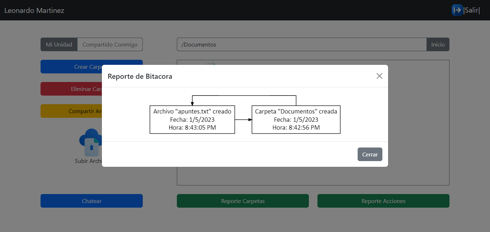
</p>
</div>

## Chatear
Al hacer click sobre el boton "Chatear" el usuario sera redireccionado a otra pantalla donde podra enviar mensajes a todos los estudiantes que se encuentran cargados en el sistema. La imagen de acontinuacion muestra la nueva pantalla a la cual sera direccionado el usuario.

<div>
<p style = 'text-align:center;'>
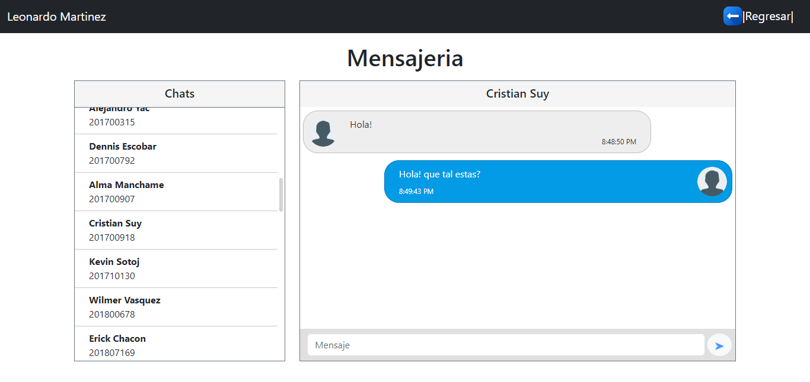
</p>
</div>

## Autor ✒️
* [Pedro Luis Tavico](https://github.com/luis-tavico)